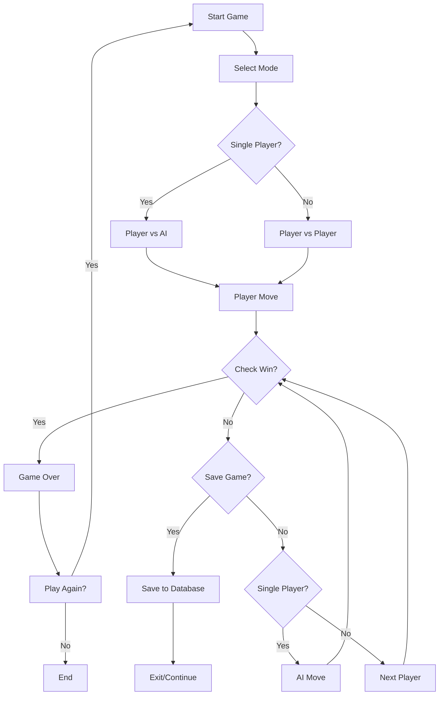

# The X-O Game 🎮

**Modern Tic-Tac-Toe with AI, Multiplayer & Game Persistence**

A sophisticated implementation of the classic Tic-Tac-Toe game featuring AI opponent, multiplayer mode, and save/resume functionality. Built with Python and SQLite for a seamless gaming experience.


## 🎥 Demo

**Video Demo**: [Watch on YouTube](https://youtu.be/wjhAN60FYqE)

## 🌟 Features

- **🤖 Single-Player AI Mode**: Challenge yourself against an intelligent AI opponent
- **👥 Two-Player Mode**: Classic head-to-head gameplay for two players
- **💾 Save & Resume**: Pause your game anytime and continue later
- **🗄️ Game Persistence**: SQLite database stores game states reliably
- **🎯 Smart AI Logic**: AI uses strategic algorithms to provide competitive gameplay
- **📊 Win Detection**: Automatic recognition of winning patterns and draws
- **🔄 Load Saved Games**: Access and resume any previously saved game

## 🛠️ Technology Stack

- **Language**: Python 3.x
- **Database**: SQLite (game.db)
- **Architecture**: Modular design with separated concerns
- **AI Algorithm**: Strategic move analysis with win/block detection
- **Data Persistence**: Local database storage for game states

## 🚀 Getting Started

### Prerequisites
- Python 3.6 or higher
- SQLite (included with Python)

### Installation & Setup

1. **Clone the repository**
   ```bash
   git clone https://github.com/yash-goyal-0910/The-X-O-Game.git
   cd The-X-O-Game
   ```

2. **Run the game**
   ```bash
   python x-o_game.py
   ```

3. **Start playing!**
   - Choose between single-player (vs AI) or two-player mode
   - Save your game at any point to resume later
   - Load previously saved games from the main menu

## 🎮 How to Play

### Game Modes
1. **Single-Player**: Play against the AI opponent that strategically blocks your moves and seeks winning opportunities
2. **Two-Player**: Take turns with a friend on the same computer
3. **Resume Game**: Continue any saved game from where you left off

### Controls
- Enter row and column numbers (1-3) to place your mark
- Follow on-screen prompts for saving/loading games
- The game automatically detects wins, losses, and draws

### Winning Conditions
- Get three of your marks (X or O) in a row horizontally, vertically, or diagonally
- The game automatically detects and announces the winner
- If all 9 spaces are filled without a winner, it's a draw

## 📁 Project Structure

```
The-X-O-Game/
├── x-o_game.py         # Main game logic and user interface
├── ai.py               # AI opponent logic and algorithms
├── game.db            # SQLite database for game persistence
└── README.md          # Project documentation
```

### File Descriptions

#### `x-o_game.py` - Core Game Engine
- **User Interface**: Displays game board and manages player input
- **Game Mechanics**: Win condition checking and draw detection
- **Save/Load System**: Database integration for game persistence
- **Mode Selection**: Handles single-player and multiplayer modes

#### `ai.py` - Artificial Intelligence
- **Strategic Analysis**: Evaluates board positions for optimal moves
- **Win Detection**: Identifies immediate winning opportunities
- **Block Logic**: Prevents player from winning when possible
- **Move Optimization**: Selects best available moves using game theory

#### `game.db` - Game Database
- **Game States**: Stores current board configurations
- **Player Data**: Tracks player turns and game progress
- **Timestamps**: Records when games were saved
- **Multiple Saves**: Supports multiple concurrent saved games

## 🎯 AI Strategy

The AI opponent uses sophisticated algorithms to provide challenging gameplay:

- **Threat Assessment**: Analyzes potential winning moves for both players
- **Strategic Blocking**: Prevents player victories by blocking winning combinations
- **Opportunity Recognition**: Identifies and executes winning moves when available
- **Optimal Positioning**: Selects strategically advantageous board positions

## 🔮 Future Enhancements

### Planned Features
- **🧠 Advanced AI**: Implement minimax algorithm for unbeatable AI
- **🌐 Online Multiplayer**: Network play between remote players
- **🎨 GUI Interface**: Graphical interface using Tkinter or Pygame
- **📈 Statistics**: Win/loss tracking and player performance metrics
- **🏆 Leaderboards**: Competitive rankings and achievements
- **🎵 Sound Effects**: Audio feedback for moves and wins
- **🎨 Themes**: Customizable board designs and color schemes

### Technical Improvements
- **⚡ Performance**: Optimize AI algorithms for faster response
- **🔒 Data Validation**: Enhanced input validation and error handling
- **📱 Mobile Support**: Potential mobile app development
- **🔧 Unit Tests**: Comprehensive test coverage for reliability

## 🤝 Contributing

Contributions are welcome! Here's how you can help:

### Areas for Contribution
- **🤖 AI Improvements**: Enhance AI algorithms (minimax, alpha-beta pruning)
- **🎨 UI/UX**: Create graphical interface or improve console experience
- **🌐 Networking**: Implement online multiplayer functionality
- **📊 Analytics**: Add game statistics and player tracking
- **🧪 Testing**: Write unit tests and improve code coverage

### How to Contribute
1. Fork the repository
2. Create a feature branch (`git checkout -b feature/amazing-feature`)
3. Commit your changes (`git commit -m 'Add amazing feature'`)
4. Push to the branch (`git push origin feature/amazing-feature`)
5. Open a Pull Request

## 🎲 Game Flow



## 📊 Technical Specifications

- **Programming Language**: Python 3.6+
- **Database**: SQLite 3
- **Architecture Pattern**: Modular/Component-based
- **AI Complexity**: Strategic heuristic-based
- **Storage**: Local file-based persistence
- **Platform**: Cross-platform (Windows, macOS, Linux)

## 📝 Requirements

```txt
python>=3.6
sqlite3 (built-in)
```

## 🐛 Known Issues

- Console-based interface may not display optimally on all terminals
- AI difficulty is fixed (not adjustable)
- No undo functionality for moves

## 📄 License

This project is licensed under the MIT License - see the [LICENSE](LICENSE) file for details.

## 🙏 Acknowledgements

- **Classic Tic-Tac-Toe**: Inspired by the timeless strategy game
- **Python Community**: For excellent documentation and libraries
- **SQLite**: For lightweight, reliable database functionality
- **Open Source**: Built with open-source tools and community support

## 📧 Contact

**Yash Goyal** - [@yash-goyal-0910](https://github.com/yash-goyal-0910)
- Email: yashgoyal09102005@gmail.com
- GitHub: [https://github.com/yash-goyal-0910](https://github.com/yash-goyal-0910)

---

⭐ **Star this repository if you enjoyed the game!**

🔗 **Project Link**: [https://github.com/yash-goyal-0910/The-X-O-Game](https://github.com/yash-goyal-0910/The-X-O-Game)

🎮 **Play Now**: Clone and run `python x-o_game.py` to start gaming!
